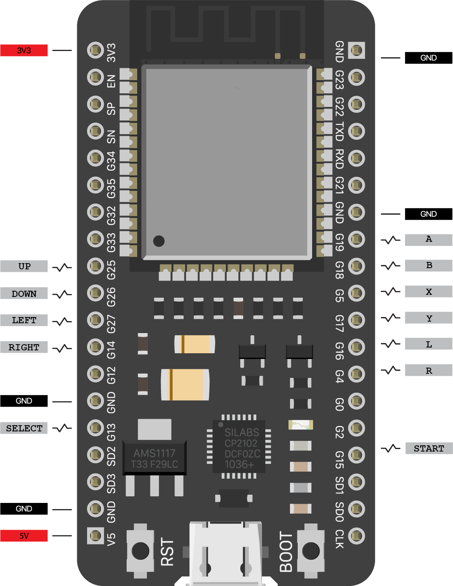
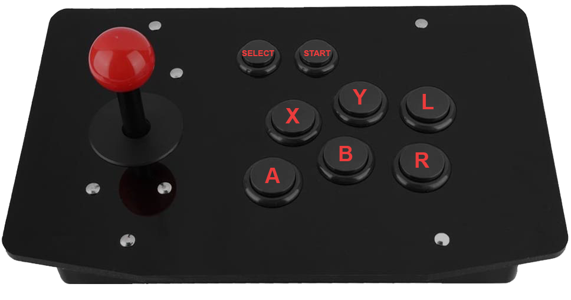

# ESP32ArcadeBLEController
Arduino sketch used to build a bluetooth LE arcade controller

## Hardware
- ESP32
- Arcade kit (buttons, cable, joystick) or separate parts

 

## Library
 - [ESP32-BLE-Gamepad](https://github.com/lemmingDev/ESP32-BLE-Gamepad)
