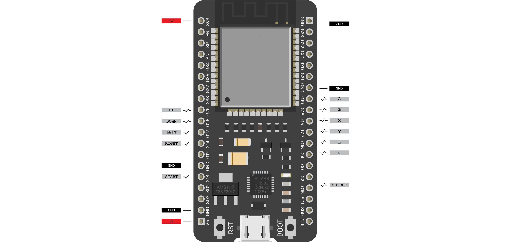
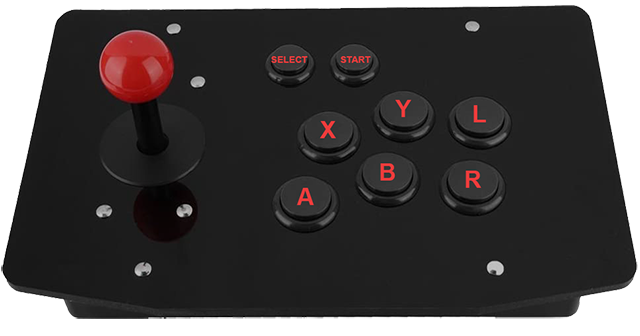

# ESP32 Arcade BLE Controller
Arduino sketch used to build a bluetooth LE arcade controller based on ESP32.

## Hardware
- ESP32
- Arcade kit (buttons, cable, joystick) or separate parts

 

## Libraries
 - [NimBLE-Arduino](https://github.com/h2zero/NimBLE-Arduino) by h2zero
 - [ESP32-BLE-Gamepad](https://github.com/lemmingDev/ESP32-BLE-Gamepad) by lemmingDev Version 0.4.3

## Before compilation
 - Make sure you can use the ESP32 with the Arduino IDE ([arduino-esp32](https://github.com/espressif/arduino-esp32#installation-instructions))
 - Install NimBLE-Arduino (in Arduino IDE go to Tools > Manage Libraries... > Filter for "NimBLE-Arduino" by h2zero and install)
 - Install ESP32-BLE-Gamepad by lemmingDev Version 0.4.3 (in Arduino IDE go to Tools > Manage Libraries... > Filter for "ESP32-BLE-Gamepad" and install)

# Enjoy ESP32ArcadeBLEController